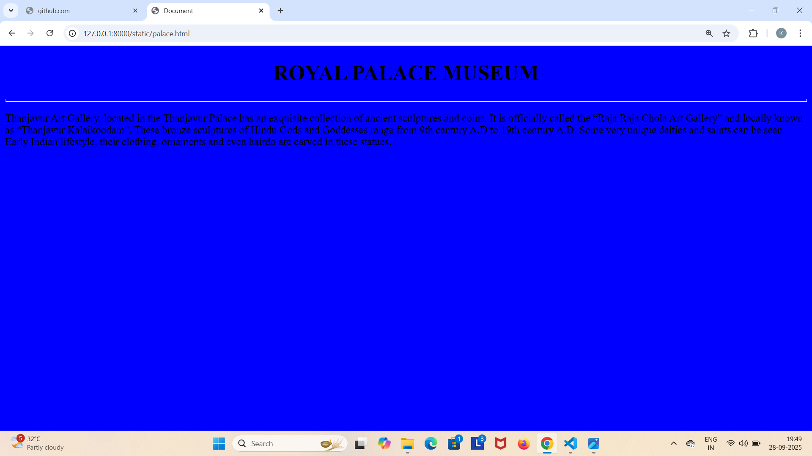
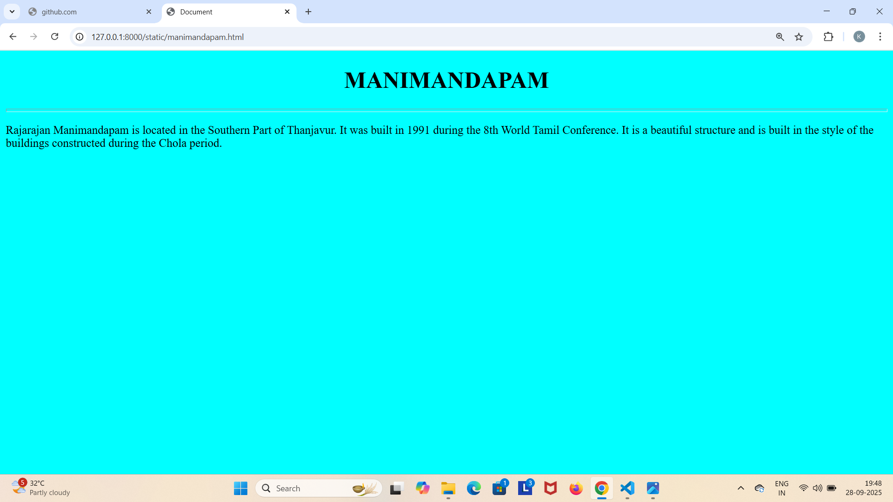
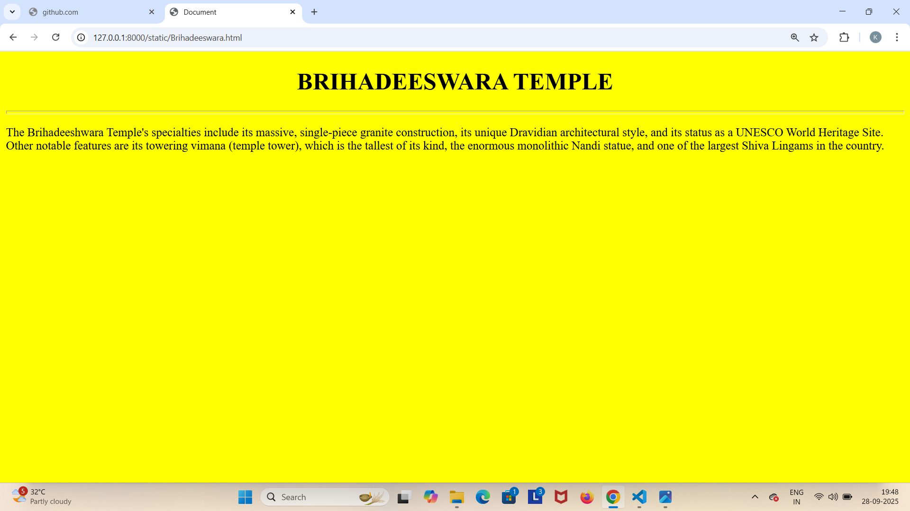
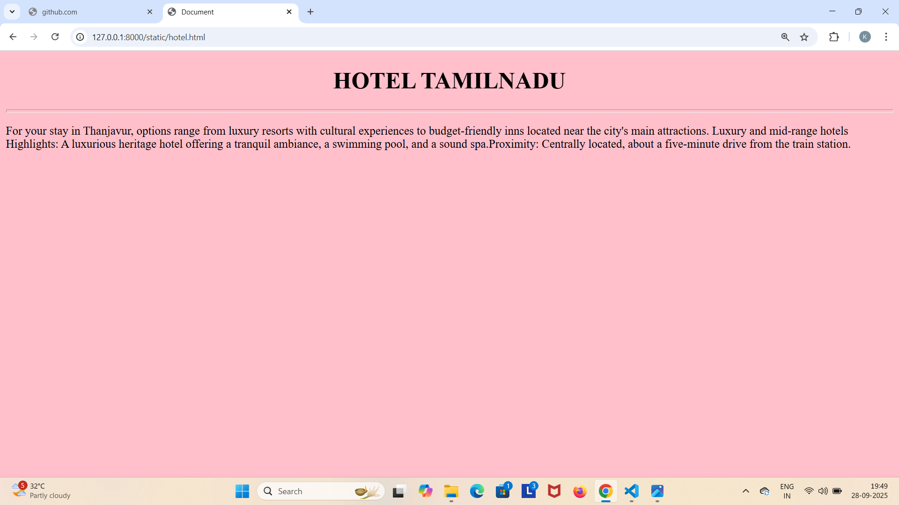
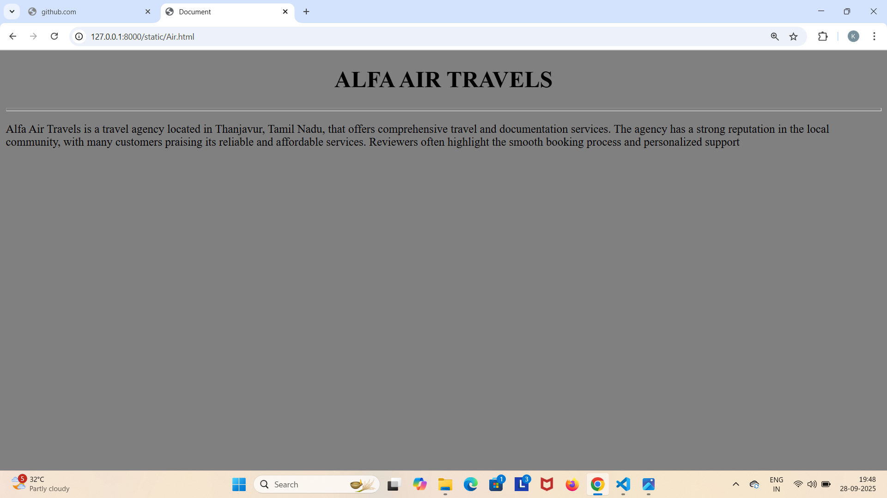

# Ex04 Places Around Me
## Date: 28.09.2025

## AIM
To develop a website to display details about the places around my house.

## DESIGN STEPS

### STEP 1
Create a Django admin interface.

### STEP 2
Download your city map from Google.

### STEP 3
Using ```<map>``` tag name the map.

### STEP 4
Create clickable regions in the image using ```<area>``` tag.

### STEP 5
Write HTML programs for all the regions identified.

### STEP 6
Execute the programs and publish them.

## CODE
```
map.html

<html>
    <head>
        <title>sample page</title>
        </head>
        <body>
            <h1 align="center">THANJAVUR</h1>
            <h1 align="center">KANCHANA M (25016997)</h1>
            

<map name="image-map">
    <area target="" alt="Royal palace Museum" title="Royal palace Museum" href="palace.html" coords="551,304,788,361" shape="rect">
    <area target="" alt="Manimandapam" title="Manimandapam" href="manimandapam.html" coords="565,766,86" shape="circle">
    <area target="" alt="Brihadeeswara temple" title="Brihadeeswara temple" href="Brihadeeswara.html" coords="458,502,517,458,614,478,617,556,534,583,471,561,471,563,472,562" shape="poly">
    <area target="" alt="Hotel Tamilnadu" title="Hotel Tamilnadu" href="hotel.html" coords="884,509,794,586,969,584" shape="poly">
    <area target="" alt="ALFA AIR TRAVELS " title="ALFA AIR TRAVELS " href="Air.html" coords="289,719,199,780,229,843,312,842,353,781" shape="poly">
</map>
</body>
</html>

palace.html

<!DOCTYPE html>
<html lang="en">
<head>
    <meta charset="UTF-8">
    <meta name="viewport" content="width=device-width, initial-scale=1.0">
    <title>Document</title>
</head>
<body bgcolor="blue">
    <h1 align="center">ROYAL PALACE MUSEUM</h1>
    <hr size="5">
    <p>
        Thanjavur Art Gallery, located in the Thanjavur Palace has an exquisite collection of ancient sculptures and coins. It is officially called the “Raja Raja Chola Art Gallery” and locally known as “Thanjavur Kalaikoodam”. These bronze sculptures of Hindu Gods and Goddesses range from 9th century A.D to 19th century A.D. Some very unique deities and saints can be seen. Early Indian lifestyle, their clothing, ornaments and even hairdo are carved in these statues. 
    </p>
    
</body>
</html>

manimandapam.html

<!DOCTYPE html>
<html lang="en">
<head>
    <meta charset="UTF-8">
    <meta name="viewport" content="width=device-width, initial-scale=1.0">
    <title>Document</title>
</head>
<body bgcolor="cyan">
    <h1 align="center">MANIMANDAPAM</h1>
    <hr size="5">
    <p>
        Rajarajan Manimandapam is located in the Southern Part of Thanjavur. It was built in 1991 during the 8th World Tamil Conference. It is a beautiful structure and is built in the style of the buildings constructed during the Chola period.
    </p>
    
</body>
</html>

brihadeeswara.html

<!DOCTYPE html>
<html lang="en">
<head>
    <meta charset="UTF-8">
    <meta name="viewport" content="width=device-width, initial-scale=1.0">
    <title>Document</title>
</head>
<body bgcolor="yellow">
    <h1 align="center">BRIHADEESWARA TEMPLE</h1>
    <hr size="5">
    <p>
        The Brihadeeshwara Temple's specialties include its massive, single-piece granite construction, its unique Dravidian architectural style, and its status as a UNESCO World Heritage Site. Other notable features are its towering vimana (temple tower), which is the tallest of its kind, the enormous monolithic Nandi statue, and one of the largest Shiva Lingams in the country.  
    </p>
    
</body>
</html>

hotel.html

<!DOCTYPE html>
<html lang="en">
<head>
    <meta charset="UTF-8">
    <meta name="viewport" content="width=width-device, initial-scale=1.0">
    <title>Document</title>
</head>
<body bgcolor="pink">
    <h1 align="center">HOTEL TAMILNADU</h1>
    <hr size="5">
    <p>
        For your stay in Thanjavur, options range from luxury resorts with cultural experiences to budget-friendly inns located near the city's main attractions. Luxury and mid-range hotels Highlights: A luxurious heritage hotel offering a tranquil ambiance, a swimming pool, and a sound spa.Proximity: Centrally located, about a five-minute drive from the train station.
    </p>
    
</body>
</html>

air.html

<!DOCTYPE html>
<html lang="en">
<head>
    <meta charset="UTF-8">
    <meta name="viewport" content="width=device-width, initial-scale=1.0">
    <title>Document</title>
</head>
<body bgcolor="grey">
    <h1 align="center">ALFA AIR TRAVELS</h1>
    <hr size="5">
    <p>
        Alfa Air Travels is a travel agency located in Thanjavur, Tamil Nadu, that offers comprehensive travel and documentation services. The agency has a strong reputation in the local community, with many customers praising its reliable and affordable services. Reviewers often highlight the smooth booking process and personalized support
    </p>
    
</body>
</html>

```


## OUTPUT







## RESULT
The program for implementing image maps using HTML is executed successfully.
